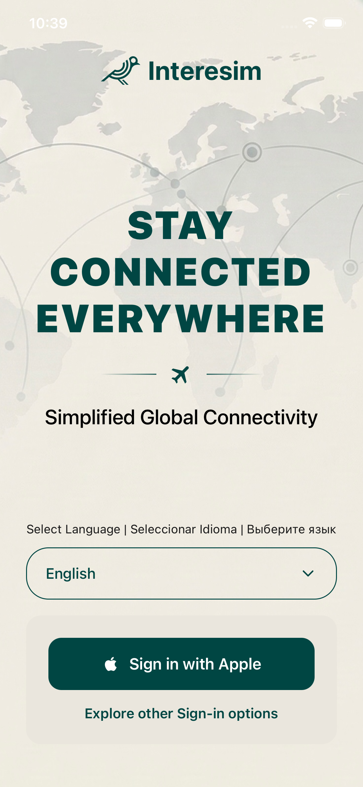
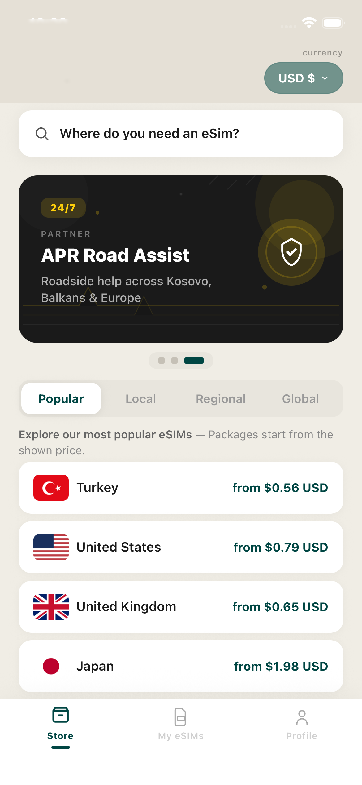
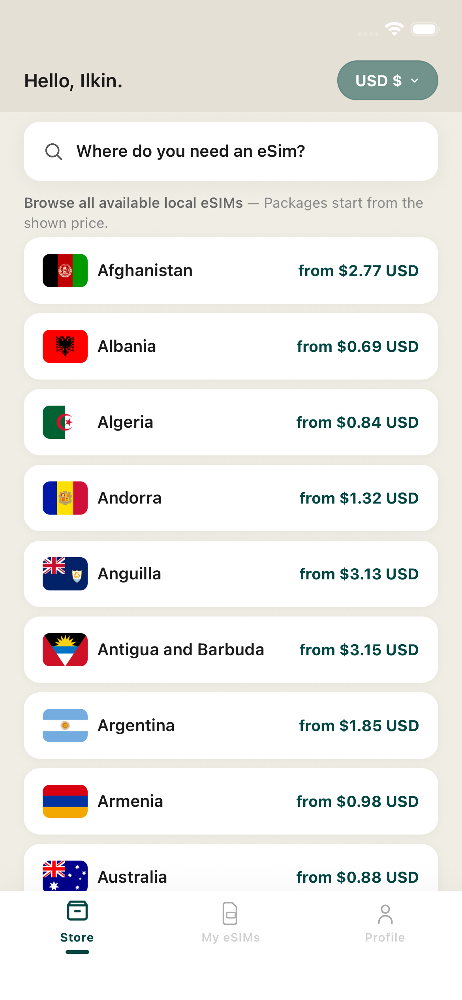
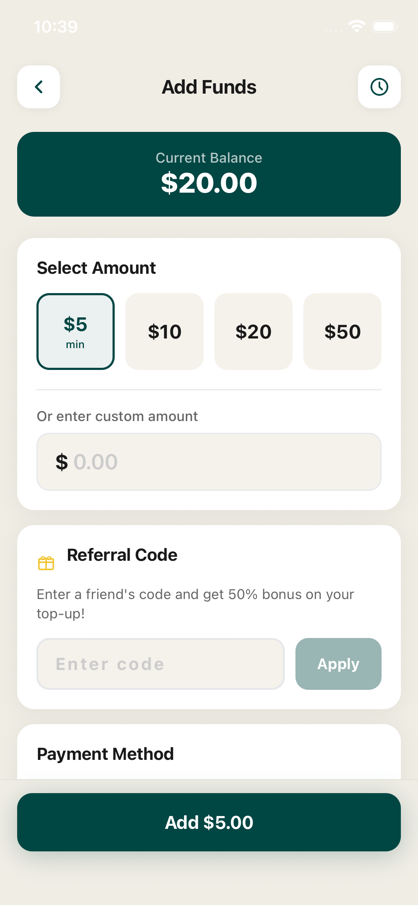
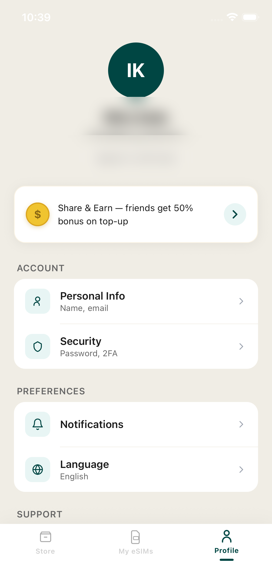

# Interesim - eSIM Marketplace App

A production-ready mobile application for purchasing and managing eSIM data plans for international travelers. Covers 190+ countries with instant digital activation — no physical SIM card needed.

> This repository is a project showcase. Source code is proprietary.

## Screenshots

### Sign In


### Store — eSIM Marketplace


### Country Plans


### Wallet — Add Funds


### Profile


### Refer & Earn


## What It Does

Interesim lets travelers buy affordable data plans before or during their trip. Users browse plans by country, purchase with their in-app wallet, and activate the eSIM instantly via QR code — all without visiting a store or swapping SIM cards.

## Features

### eSIM Marketplace
- Browse data plans across 190+ countries and multi-country regions
- Smart search and filtering by destination, data amount, duration, and price
- Multi-currency display (USD, EUR, TRY) with real-time conversion
- Curated popular destinations carousel
- Promotional campaign banners with seasonal offers

### eSIM Activation & Management
- One-tap QR code generation for instant eSIM activation
- Real-time status dashboard (active, expiring soon, expired, pending)
- Live data usage tracking with remaining GB and usage percentage
- Countdown timer showing days until plan expiration
- Operator name and APN configuration details

### In-App Wallet
- Dedicated wallet with balance management
- Multiple top-up options
- Complete transaction history — purchases, deposits, referral bonuses
- Secure balance-based checkout flow

### Authentication System
- Email/password registration with OTP email verification
- Social sign-in: Google, Apple, X/Twitter, Facebook
- Guest mode — browse the full catalog without creating an account
- Two-factor authentication using TOTP (authenticator app support)
- Platform-aware login: Apple Sign-In on iOS, Google on Android

### Referral Program
- Unique shareable referral codes per user
- Dashboard tracking referred users and total earnings
- Automatic bonus rewards credited to wallet on successful referrals

### 11-Language Support
English, Turkish, Spanish, French, German, Arabic, Japanese, Korean, Mandarin Chinese, Portuguese, Albanian — with full UI localization

### Push Notifications
- Configurable notification preferences per user
- Alerts for plan expiration, low data, successful purchases, referral activity

### Polished User Experience
- 3-screen animated onboarding with wave effects and parallax scrolling
- Spring-physics tab bar with bounce animations
- Animated bird character guiding users through email verification
- Smooth transitions and micro-interactions throughout
- Fully responsive across all iOS and Android screen sizes

## Tech Stack

| Layer | Technology |
|-------|-----------|
| **Framework** | React Native + Expo SDK 54 |
| **Language** | TypeScript |
| **Navigation** | Expo Router (file-based routing) |
| **State Management** | Zustand with AsyncStorage persistence |
| **Backend** | Supabase — Auth, PostgreSQL Database, Edge Functions |
| **eSIM Provider** | YeSIM Partner API |
| **Animations** | react-native-reanimated |
| **Push Notifications** | expo-notifications |
| **Crash Reporting** | Firebase Crashlytics |
| **Platforms** | iOS + Android |

## Project Structure

```
app/                                    # Expo Router — file-based navigation
  _layout.tsx                           #   Root stack navigator + deep-link handler
  index.tsx                             #   Splash screen — auth check & routing
  onboarding.tsx                        #   3-page animated onboarding carousel
  signin.tsx                            #   Sign-in (Apple on iOS, Google on Android)
  signup.tsx                            #   Sign-up with all OAuth provider options
  email-auth.tsx                        #   Email/password flow with OTP verification
  checkout.tsx                          #   Purchase confirmation & payment
  esim-detail.tsx                       #   eSIM details view with QR activation code
  country.tsx                           #   Country-specific plan listing
  add-funds.tsx                         #   Wallet top-up screen
  mfa-verify.tsx                        #   MFA verification during login
  two-factor.tsx                        #   2FA setup with authenticator app
  personal-info.tsx                     #   Edit profile (name, email)
  security.tsx                          #   Password change + 2FA settings
  notifications.tsx                     #   Push notification preferences
  language.tsx                          #   Language selection (11 languages)
  referral.tsx                          #   Referral program dashboard
  help-center.tsx                       #   Support & FAQ
  about.tsx                             #   App information
  (tabs)/                               #   Bottom tab navigation
    _layout.tsx                         #     Tab bar with spring bounce animations
    index.tsx                           #     Store — eSIM marketplace catalog
    esims.tsx                           #     My eSIMs — purchased plans & status
    profile.tsx                         #     Profile — account & settings

src/
  features/                             # Screen implementations organized by domain
    auth/                               #   SignInScreen, SignUpScreen, EmailAuthScreen
    home/                               #   StoreScreen — marketplace with search & filters
    esims/                              #   MyEsimsScreen — purchased eSIM management
    profile/                            #   ProfileScreen — account settings hub
    onboarding/                         #   OnboardingScreen — animated welcome carousel
    splash/                             #   SplashScreen — launch routing logic

  lib/                                  # External service integrations
    supabase.ts                         #   Supabase client (auth, database, realtime)
    googleAuth.ts                       #   Google OAuth flow via Supabase
    xAuth.ts                            #   X/Twitter OAuth 1.0a flow via Supabase
    facebookAuth.ts                     #   Facebook OAuth flow via Supabase
    yesimApi.ts                         #   YeSIM partner API — plan fetching & caching
    notifications.ts                    #   Push notification registration & handling
    crashReporting.ts                   #   Firebase Crashlytics error logging

  store/                                # Zustand state management (persisted)
    authStore.ts                        #   Session, user data, sign-in/sign-up/sign-out
    appStore.ts                         #   First launch flag, guest mode
    esimStore.ts                        #   eSIM catalog — plans, countries, regions
    walletStore.ts                      #   Balance, transactions, top-up, deductions
    userEsimStore.ts                    #   User's purchased eSIMs with status tracking
    referralStore.ts                    #   Referral code, referred count, earnings
    languageStore.ts                    #   Language preference

  components/                           # Shared UI components
    InteresimLogo.tsx                   #   Brand SVG logo
    ErrorBoundary.tsx                   #   Global error catching wrapper

  constants/                            # App-wide configuration
    colors.ts                           #   Brand color palette
    config.ts                           #   API endpoints, timeouts, validation rules

  i18n/                                 # Internationalization
    translations.ts                     #   Translation loader and language registry
    useTranslation.ts                   #   Translation hook — const { t } = useTranslation()
    locales/                            #   Language files
      en.ts, tr.ts, es.ts, fr.ts,      #     English, Turkish, Spanish, French
      de.ts, ar.ts, ja.ts, ko.ts,      #     German, Arabic, Japanese, Korean
      zh.ts, pt.ts, sq.ts              #     Chinese, Portuguese, Albanian

supabase/                               # Backend infrastructure
  functions/
    yesim-plans/                        #   Edge Function — proxies YeSIM API (token server-side)
  migrations/                           #   Database schema migrations
    create_push_tokens.sql              #     Push notification token storage
    create_notification_preferences.sql #     Per-user notification settings
    create_crash_logs.sql               #     Client-side error logging
```

## Architecture Highlights

- **File-based routing** — Expo Router maps file paths to screens for clean, maintainable navigation
- **Feature-based code organization** — screens grouped by domain (auth, home, esims, profile) rather than by type
- **Persisted state** — Zustand stores backed by AsyncStorage so app state survives restarts
- **Server-side secrets** — Partner API tokens never touch the client; Supabase Edge Functions handle sensitive calls
- **Deep linking** — Custom URL scheme (`apr-esim://`) handles OAuth callbacks and email verification seamlessly
- **Multi-layer caching** — In-memory cache with 10-minute TTL + AsyncStorage fallback for offline access to eSIM plans
- **Platform-aware authentication** — iOS users see Apple Sign-In, Android users see Google — following each platform's conventions

## Contact

For business inquiries or collaboration, reach out via GitHub.

## License

All Rights Reserved. This repository is for showcase purposes only. See [LICENSE](LICENSE) for details.
